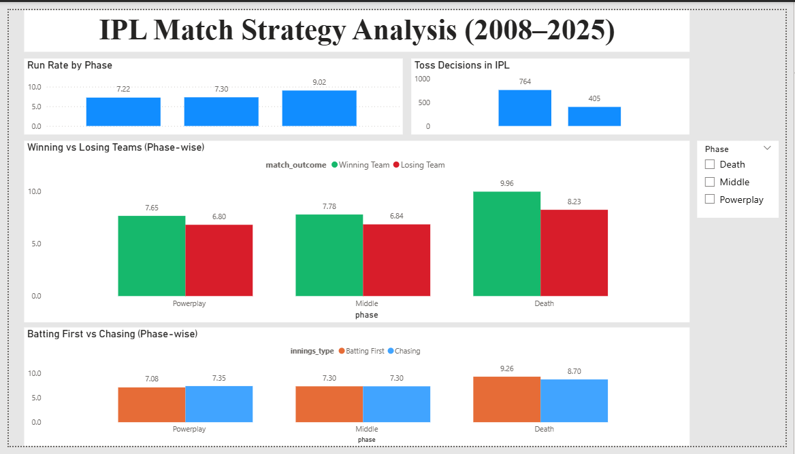
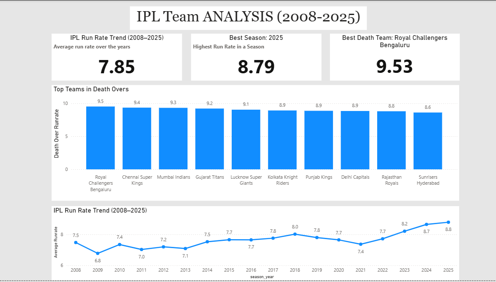
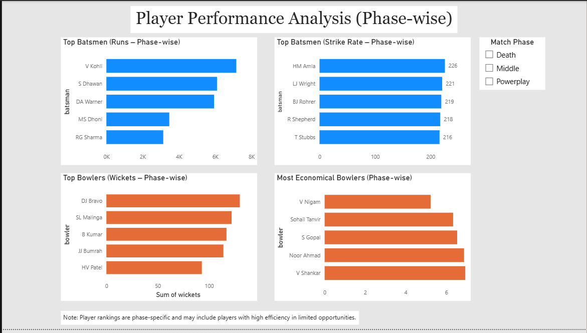

# IPL Match Strategy Analysis (2008–2025)

## 📌 Project Overview

This project analyzes Indian Premier League (IPL) data to uncover patterns in match strategy, team performance, and player impact. The analysis focuses on how different phases of a T20 match influence outcomes and player roles.

The project uses SQL for data extraction and transformation, and Power BI for building interactive dashboards.

---

## 🎯 Objectives

* Analyze run rate trends across match phases (Powerplay, Middle, Death)
* Compare winning vs losing team performance
* Evaluate batting first vs chasing strategies
* Identify top-performing teams in death overs
* Analyze player performance based on match phases

---

## 🛠 Tools & Technologies

* **SQL (SQLite)** – Data querying and transformation
* **Power BI** – Dashboard creation and visualization
* **Excel** – Data storage and intermediate processing

---

## 📊 Dashboard Preview

### 🔹 Match Strategy Analysis



---

### 🔹 Team Performance Analysis



---

### 🔹 Player Performance Analysis (Phase-wise)



---

## 🔍 Key Insights

* 🔥 **Death overs are the most impactful phase**, with the highest run rates
* 🏏 **Winning teams consistently outperform losing teams** across all phases
* ⚖️ **Batting first vs chasing shows marginal differences**, suggesting situational dependency
* 📈 **IPL scoring trends have increased over time**, indicating more aggressive gameplay
* 🎯 **Player roles vary by phase**, with different players excelling in Powerplay, Middle, and Death overs

---

## ⚠️ Note on Player Analysis

Player rankings are phase-specific and may include players with high efficiency in limited opportunities. The focus is on **impact within a match phase**, rather than overall career performance.

---

## 📂 Project Structure

```
ipl-match-analysis/
│
├── dashboard/
│   └── IPL_Dashboard.pbix
│
├── data/
│   └── IPL_Analysis.xlsx
│
├── images/
│   ├── page1.png
│   ├── page2.png
│   └── page3.png
│
├── sql/
│   └── queries.sql
│
└── README.md
```

---

## 🚀 Conclusion

This project demonstrates how data analysis can provide strategic insights in cricket. By focusing on match phases, it highlights the importance of situational performance over aggregate statistics.

---

## 🔮 Future Improvements

* Apply filters for minimum balls/matches in player analysis
* Include venue and toss impact deeper analysis
* Add predictive modeling for match outcomes
* Enhance interactivity with advanced filters

---

## 👤 Author

Vinay Mehra

---
